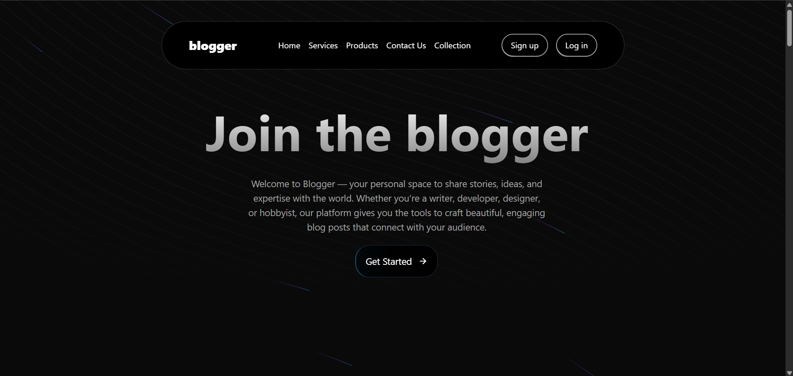
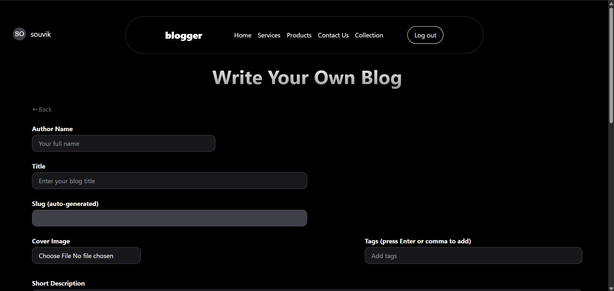
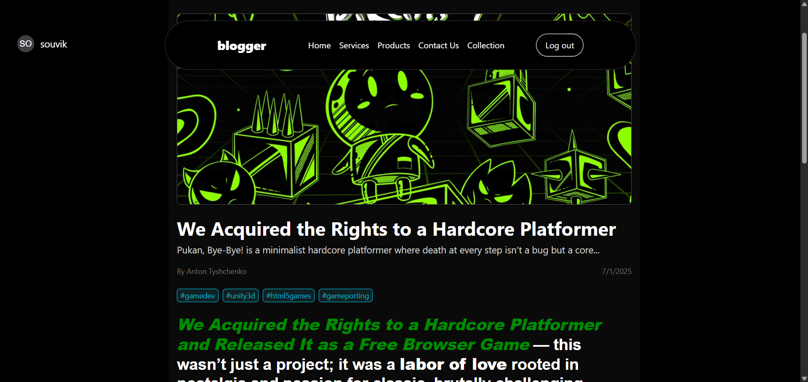

# 📝 Blogger - A Fullstack Blogging Platform

Blogger is a modern fullstack blogging platform built with the **MERN stack** (MongoDB, Express.js, React.js, Node.js). It allows users to create, publish, manage, and explore blogs with rich formatting, AI-assisted descriptions, tag filters, and user authentication.

## 🚀 Live Demo

Check out the live version here:  
👉 [https://blogger-lake-kappa.vercel.app/](https://blogger-lake-kappa.vercel.app/)

## 📦 GitHub Repository

View the complete source code:  
👉 [https://github.com/Souvik-Dutta12/blogger](https://github.com/Souvik-Dutta12/blogger)

---

## ✨ Features

- ✅ User authentication (Login/Signup)
- 🧠 AI-powered blog description generator
- ✍️ Rich-text blog writing and editing
- 🏷️ Tag filtering system
- 📚 Browse all blogs with pagination
- 🔍 Search blogs by tags
- 🖼️ Upload cover images
- 💬 Comment section
- 🔐 Protected routes and user dashboard
- 📱 **Fully responsive design** — optimized for mobile, tablet, and desktop

---

## 🛠️ Tech Stack

**Frontend**:
- React.js
- Tailwind CSS
- Axios
- React Router DOM

**Backend**:
- Node.js
- Express.js
- MongoDB Atlas
- Mongoose
- OpenAI API (for AI descriptions)

**Deployment**:
- Frontend: [Vercel](w)
- Backend: [Render](w)
- Database: [MongoDB Atlas](w)

---

## 📸 Screenshots

### 🏠 Homepage

### ✍️ WriteBlog

### 🧑‍💻 ReadBlog
